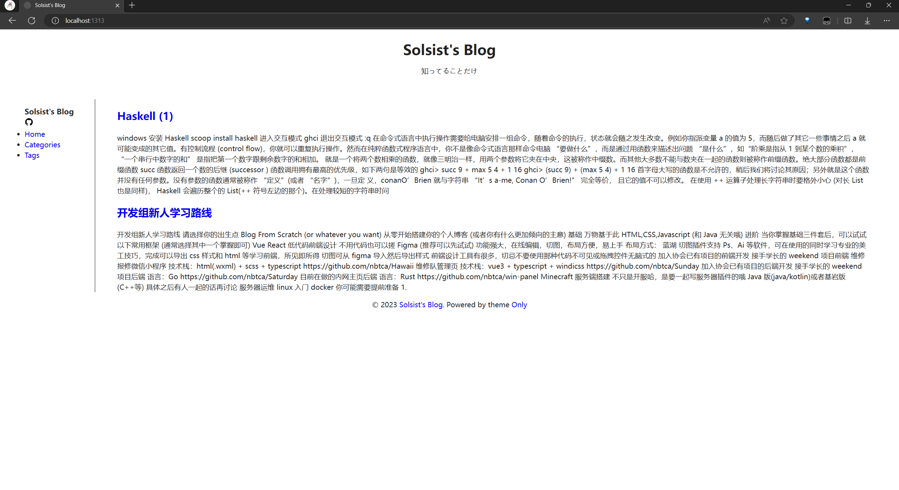
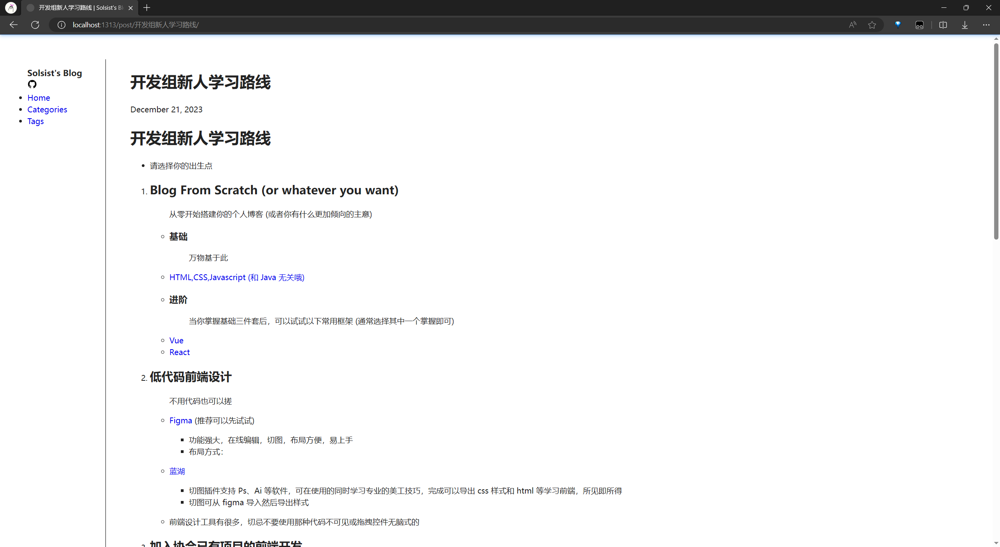
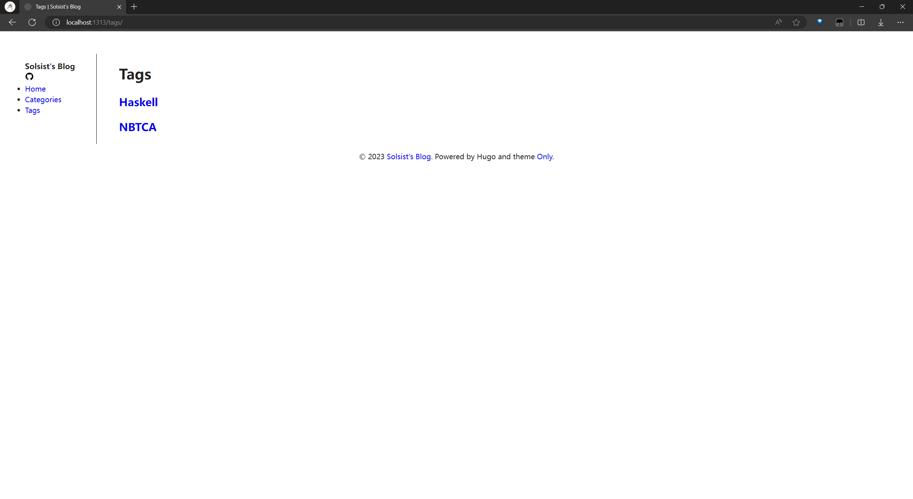

<div align="center">
<h1>Only</h1>
A Native, Simple, Oppose Flashy theme for Hugo
</div>

## Introduction
Just a slight modification to the native theme.

## Overview




## Configuration
For hugo.toml 
```toml
baseURL = ''
languageCode = 'zh-CN'
title = "Solsist's Blog"
theme = "Only"

[[menus.main]]
name = 'Home'
pageRef = '/'
weight = 10

[[menus.main]]
name = 'Tags'
pageRef = '/tags'
weight = 30

[[menus.main]]
name = 'Categories'
pageRef = '/categories'
weight = 30

[[menus.main]]
name = 'Tags'
pageRef = '/tags'
weight = 30

[module]
  [module.hugoVersion]
    extended = false
    min = "0.116.0"

[taxonomies]
  tag = "tags"
  category = "categories"

[params]
  bio = "知ってることだけ"
  github = "https://github.com/sols1st"
```
